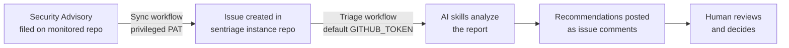
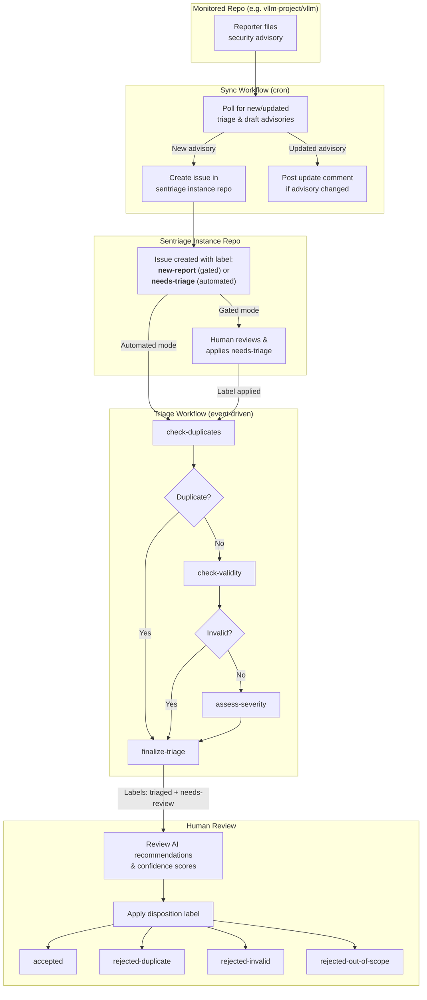

# Sentriage

  

  AI-powered triage for private security vulnerability reports. 
  Automates severity assessment, deduplication, and validation.

## Overview

Sentriage is a set of composable tools that use AI to triage private
security vulnerability reports (GitHub Security Advisories). It helps
security teams process incoming reports faster by automating initial
analysis — either fully automatically or with human-in-the-loop
checkpoints at each stage.

### What it does

- **Syncs** new vulnerability reports from monitored repos into a private tracking repo
- **Checks for duplicates** against existing reports
- **Validates** whether reported vulnerabilities exist in the source code
- **Assesses severity** independently using CVSS criteria
- **Recommends** disposition with confidence scores
- **Short-circuits** the pipeline when a report is identified as duplicate or invalid
- **Never decides** — all final dispositions are made by humans

### Two operating modes

**Automated triage** — New reports are synced with a `needs-triage` label,
which immediately triggers AI analysis. Best for teams with high report
volume who want AI to do an initial pass before human review.

**Gated triage** — New reports are synced with a `new-report` label. A
human reviews the report and applies `needs-triage` when ready, triggering
AI analysis on demand. Best for teams who want to screen reports before
spending API credits.

Both modes produce the same output: skill results posted as issue comments
with confidence scores, ready for human review.

## How it works

Sentriage uses two separate workflows with distinct security boundaries:

### Detailed flow

### Security architecture

The sync and triage workflows are intentionally separated:

| Workflow | Token | Access | Runs |
|---|---|---|---|
| **Sync** | `ADVISORY_TOKEN` (privileged PAT) | Read advisories from monitored repos | No AI, just Python script |
| **Triage** | Default `GITHUB_TOKEN` | Read/write issues in instance repo only | Claude Code in container |

The privileged token never reaches the AI runtime. Report content is
written to a file on disk — it is never embedded in the AI prompt,
eliminating the primary prompt injection vector.

## Quick Start

See the [Getting Started](docs/getting-started.md) guide.

## Built-in Skills

| Skill | Purpose |
|---|---|
| `check-duplicates` | Find duplicate or related reports |
| `check-validity` | Validate vulnerability against source code |
| `assess-severity` | Independent CVSS severity assessment |

Each skill runs as an isolated Claude Code invocation in a fresh
container — no context is shared between reports or between skills.
You can also [write custom skills](docs/custom-skills.md).

## Documentation

- [Getting Started](docs/getting-started.md)
- [Configuration](docs/configuration.md)
- [Custom Skills](docs/custom-skills.md)
- [Security Model](docs/security.md)

## Security

Sentriage is designed to handle sensitive security data. See the
[Security Model](docs/security.md) for details on how the system
protects against prompt injection, information leakage, and other threats.

If you discover a security vulnerability in sentriage itself, please
report it via GitHub's private vulnerability reporting feature.

## License

See [LICENSE](LICENSE).
