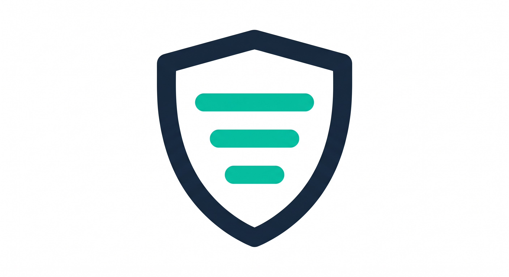

# Sentriage

  

  AI-powered triage for private security vulnerability reports. 
  Automates severity assessment, deduplication, and validation.

## Overview

Sentriage is a set of composable GitHub Actions that use AI to triage
private security vulnerability reports (GitHub Security Advisories). It
helps security teams process incoming reports faster by automating
initial analysis while keeping humans in the loop for all decisions.

### What it does

- **Detects** new vulnerability reports across your monitored repositories
- **Checks for duplicates** against existing reports
- **Validates** whether reported vulnerabilities exist in the source code
- **Assesses severity** using CVSS criteria
- **Recommends** disposition with confidence scores
- **Never decides** — all final decisions are made by humans

### How it works

1. A private GitHub repo serves as your sentriage instance
2. GitHub Actions poll your monitored repos for new security advisories
3. New reports become issues in your sentriage repo
4. AI skills analyze each report and post recommendations as comments
5. Labels drive a state machine from detection through human review

## Quick Start

See the [Getting Started](docs/getting-started.md) guide.

## Built-in Skills

| Skill | Purpose |
|---|---|
| `check-duplicates` | Find duplicate or related reports |
| `check-validity` | Validate vulnerability against source code |
| `assess-severity` | Independent CVSS severity assessment |

You can also [write custom skills](docs/custom-skills.md).

## Documentation

- [Getting Started](docs/getting-started.md)
- [Configuration](docs/configuration.md)
- [Custom Skills](docs/custom-skills.md)
- [Security Model](docs/security.md)

## Security

Sentriage is designed to handle sensitive security data. See the
[Security Model](docs/security.md) for details on how the system
protects against prompt injection, information leakage, and other threats.

If you discover a security vulnerability in sentriage itself, please
report it via GitHub's private vulnerability reporting feature.

## License

See [LICENSE](LICENSE).
